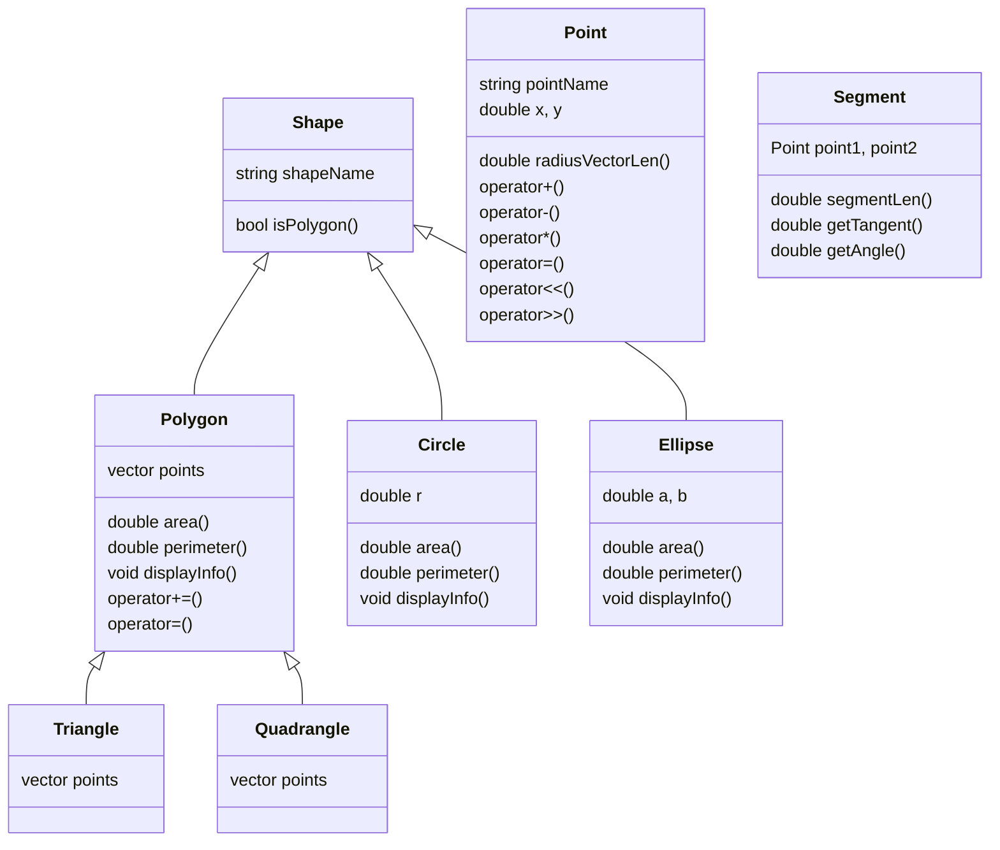

Спроектирована и реализована иерархию классов, содержащая не менее 4 классов. В каждом классе определены поля и методы, необходимые для демонстрации.
Представленная схема описывает реализованную иерархию:

